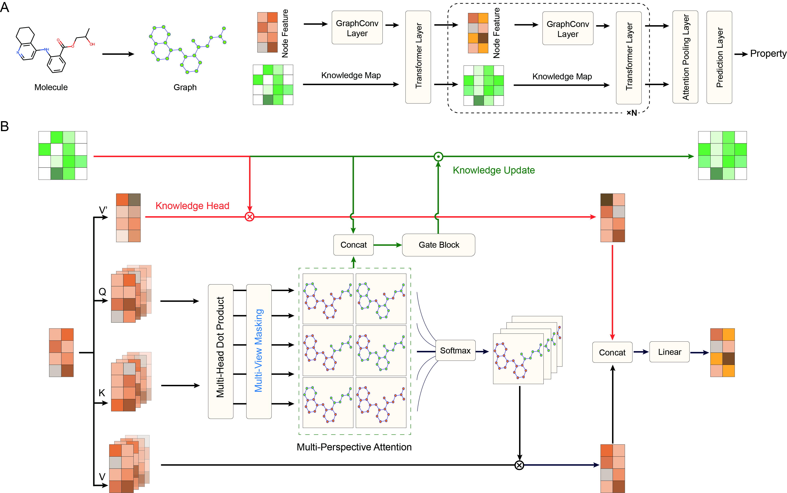

# KnoMol



This is a Pytorch implementation of the paper: https://pubs.acs.org/doi/10.1021/acs.jcim.4c01092

## Installation
You can just execute following command to create the conda environment.
'''
conda create --name KnoMol --file requirements.txt
'''

## Usage

#### 1. Dataset preparation
Put your raw csvfile(`DATASET_NAME.csv`, first column is `smiles`, followed by `label` columns) in `dataset/raw/`.
```
python molnetdata.py                   \
                --moldata DATASET_NAME \  # file name
                --task clas            \  # clas: Binary classification, reg: Regression
                --numtasks 1           \  # number of properties to predict
                --ncpu 10                 # number of cpus to use
```
This will save the processed dataset in `dataset/processed/`.

#### 2. Hyper-parameter searching
```
python run.py search DATASET_NAME                \
                --task clas                      \       # clas: Binary classification, reg: Regression
                --numtasks 1                     \       # number of properties to predict
                --seed 426                       \       # random seed
                --split random_scaffold          \       # data splitting method    random_scaffold/balan_scaffold/random
                --max_eval 100                   \       # Number hyperparameter settings to try
                --metric rmse                    \       # metric to optimize     rmse/mae (only for regression)
                --device cuda:0                          # which GPU to use
```
This will return the best hyper-params and performance in the end of the log file.

#### 3. Training
Train and save a model with the best hyper-params. Here is an example:
```
python run.py train DATASET_NAME        \
               --task reg               \
               --numtasks 1             \
               --device cuda:0          \
               --batch_size 32          \
               --train_epoch 50         \
               --lr 0.001               \
               --valrate 0.1            \
               --testrate 0.1           \
               --seed 426               \
               --split random_scaffold  \
               --fold 1                 \
               --dropout 0.05           \
               --attn_layers 2          \
               --output_dim 256         \
               --D 4                    \
               --metric rmse
```
This will save the resulting model in `log/checkpoint/xxx.pkl`.

#### 4. Testing
Make predictions using the model. Here is an example:
```
python run.py test DATASET_NAME   \
               --task clas        \
               --numtasks 1       \
               --device cuda:0    \
               --batch_size 32    \
               --attn_layers 2    \
               --output_dim 256   \
               --D 4              \
               --pretrain log/checkpoint/XXXX.pkl
```
This will load the model in `log/checkpoint/` to make predictions and the results are saved in `log/xxx.csv`.
